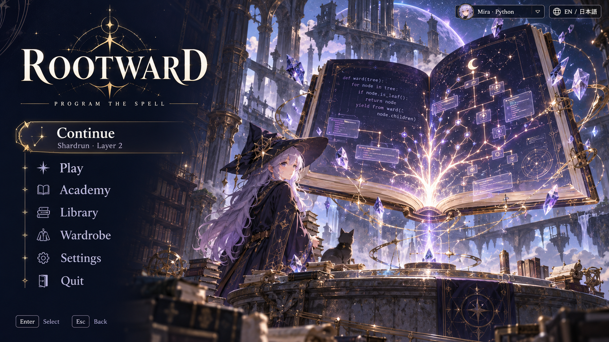
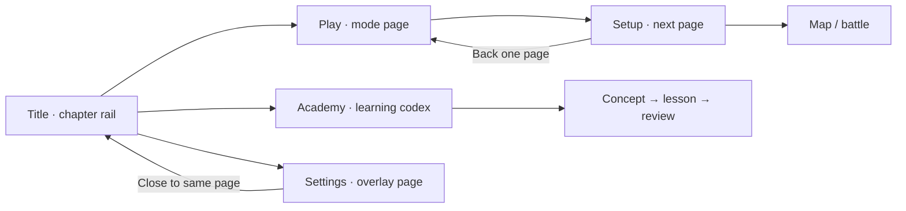

# Starfall Codex

**Celestial fantasy RPG.** The closest fit to Vesper's star-script identity: the game feels like navigating an astronomical grimoire.

| Surface | Color |
| --- | --- |
| Ink navy | `#101528` |
| Ivory | `#F1E9D9` |
| Antique gold | `#C8A56C` |
| Lilac | `#B5A5DF` |

**Navigation.** Chapter rail and nested spellbook pages. Title: a left chapter rail. Interior screens: the rail remains narrow on the left, content opens as a large page on the right. Primary actions sit at the lower outside corner of the active page.

**Typography.** Tall serif headings; readable humanist sans-serif controls and descriptions; monospace exclusively for code and measured values.

**World and art.** Astronomical libraries, stone observatories, luminous crystal shards, restrained gold mechanisms and painterly anime characters.

**Academy.** Learning grows a constellation of concepts. Lessons take place at an astral reading desk; the code editor is a stable, flat navy surface. Mastery is a labelled star, with a check mark for completed lessons.

**Motion.** Slow background parallax and a short constellation-line reveal on selection. Reduced motion uses a static outline.

**Implementation consideration.** Keep gold ornament out of dense code, settings and card descriptions. Navy and lilac need sufficient contrast at small sizes.

## Movement between menus

**Opening a section.** Selecting Play unfolds a right-hand mode page without replacing the chapter rail. Selecting a mode turns that page into setup; Begin descent opens the map. Academy opens a separate book of concepts. Back turns one page back; the rail can jump to another top-level chapter. Settings is one overlaid page that closes back to the same place.

**Keeping your place.** The current chapter, its page breadcrumb and the selected card stay visible. Returning from an overlay restores focus to the opener.

**Keyboard and reduced motion.** Every spatial sign, dock station or chapter tab is also a focusable labelled button. Tab and arrow navigation follow a predictable order; Escape goes back one level. Camera pushes, drawer slides and page turns have immediate, static alternatives when reduced motion is enabled.

## Image set

- [Title screen](01-title.png)
- [Main menus: modes, setup, profiles, wardrobe, library and settings](02-main-menus.png)
- [Academy: learning map, lesson, walkthrough and review](03-academy.png)
- [Journey: draft, map, battle and workbench](04-journey.png)
- [Run menus: rewards, rest, inventory, pause, results and help](05-run-menus.png)

These are concepts for your review, with no game changes. See the [comparison gallery](../index.html), [shared menu structure](../README.md) and [generation prompts](../prompts.json).
