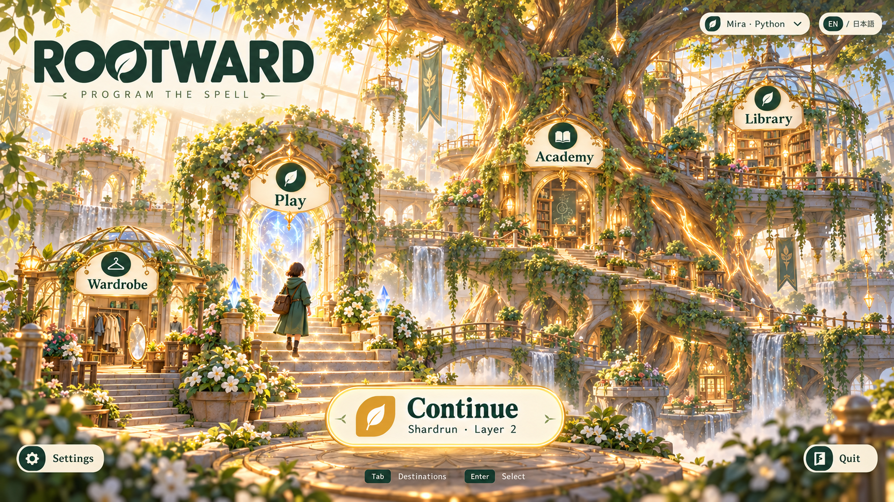
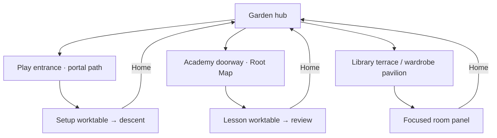

# Rootglass Garden

**Botanical fantasy academy.** A welcoming world where growing roots connects programming progress to the name Rootward.

| Surface | Color |
| --- | --- |
| Chalk | `#F7F1DF` |
| Forest | `#254E43` |
| Sage | `#A7BC9A` |
| Coral | `#D97860` |
| Marigold | `#D1A24D` |

**Navigation.** Spatial garden hub and destination rooms. Title: Play and Academy are labelled entrances around the central tree, Library is an upper terrace, Wardrobe a lower-left pavilion. Continue is a floating capsule near the bottom center. Settings and Quit are small bottom-corner utility buttons; the profile is a gardener's tag at top right.

**Typography.** Soft, substantial humanist sans-serif headings and controls; a crisp monospace editor. Readability takes priority over whimsical letterforms.

**World and art.** Glass conservatories, old machinery reclaimed by gardens, luminous roots, soft painted landscapes and modest stylized adventurers.

**Academy.** The Root Map is literal: concepts branch through a greenhouse root system. Lessons are uncluttered worktables, and feedback emphasizes growing understanding. Pip's Path fits naturally beside the adult course.

**Motion.** Small leaf movements and a gentle root-line growth reveal. Reduced motion uses an immediate state change.

**Implementation consideration.** Preserve depth and a sense of danger in Shardrun so the welcoming learning theme also supports a challenging roguelite.

## Movement between menus

**Opening a section.** Selecting a destination makes a short camera push into that room and reveals its focused task panel. Modes are portals along the garden path. Academy opens the tree's Root Map; a node opens a lesson worktable. A persistent Home leaf at bottom left returns to the same hub view. Back closes the current task panel or moves to the previous room.

**Keeping your place.** The selected garden destination is still apparent in the backdrop. Last activity appears as Continue near the central tree; mastery grows visible roots.

**Keyboard and reduced motion.** Every spatial sign, dock station or chapter tab is also a focusable labelled button. Tab and arrow navigation follow a predictable order; Escape goes back one level. Camera pushes, drawer slides and page turns have immediate, static alternatives when reduced motion is enabled.

## Image set

- [Title screen](01-title.png)
- [Main menus: modes, setup, profiles, wardrobe, library and settings](02-main-menus.png)
- [Academy: learning map, lesson, walkthrough and review](03-academy.png)
- [Journey: draft, map, battle and workbench](04-journey.png)
- [Run menus: rewards, rest, inventory, pause, results and help](05-run-menus.png)

These are concepts for your review, with no game changes. See the [comparison gallery](../index.html), [shared menu structure](../README.md) and [generation prompts](../prompts.json).
