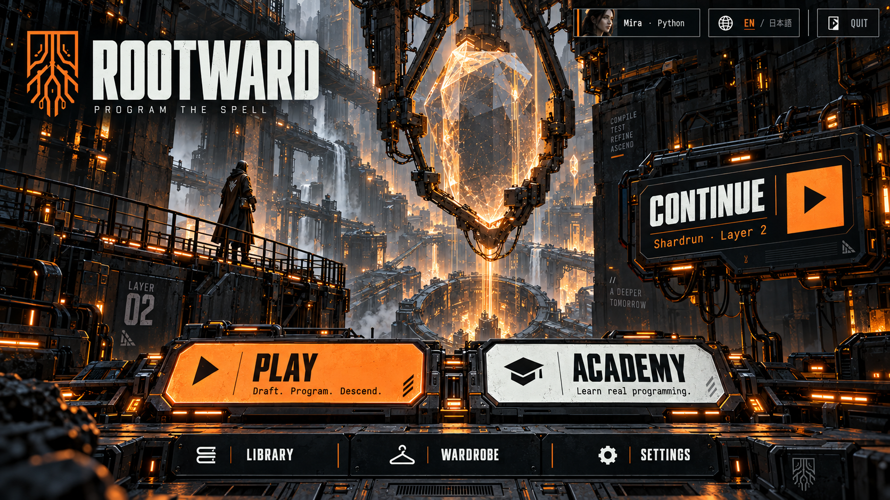
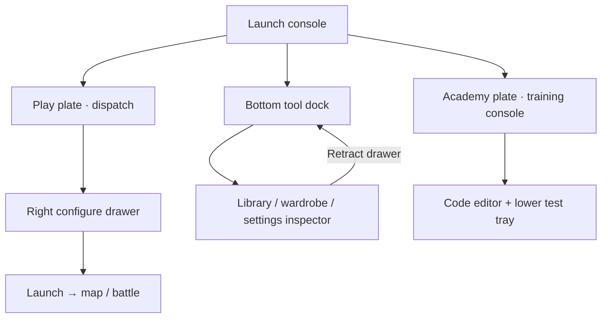

# Signal Foundry

**Industrial science fiction.** Programming feels like operating a vast machine: purposeful controls, strong hierarchy and visible measured work.

| Surface | Color |
| --- | --- |
| Carbon | `#141A1D` |
| Off-white | `#E9EEE8` |
| Safety orange | `#F18238` |
| Acid lime | `#B9D969` |
| Steel | `#5C6B70` |

**Navigation.** Launch console, bottom tool dock and sliding inspectors. Title: two large central launch plates, Play and Academy; Continue is a status card at the right. Library, Wardrobe and Settings occupy a labelled bottom dock. Quit is a small top-right utility. Interior pages retain the dock and a compact top status bar.

**Typography.** Condensed grotesk display titles, legible sans-serif UI and a restrained monospace data layer. Avoid using all caps for explanatory paragraphs.

**World and art.** Graphite gantries, compiler crystals, basalt machine chambers, amber work lights and bold cel-shaded characters against architectural environments.

**Academy.** A training station with a curriculum schematic, real editor and test bench. Feedback makes correctness and measured operations distinct. Beginners get the same clear workspace with simpler tasks.

**Motion.** Short mechanical transitions and signal-path pulses, with no flashing lights. Reduced motion swaps states immediately.

**Implementation consideration.** Friendly teaching copy and generous whitespace are essential so the machine theme remains approachable to a first-time programmer.

## Movement between menus

**Opening a section.** Play expands its launch plate into a dispatch console. Modes are selected on a horizontal strip above the central preview. Configure slides in from the right; Launch takes over the console with the map. Library, Wardrobe and Settings slide up from their dock buttons as inspectors. Academy switches to the training console without changing the dock. Back retracts the inspector; Home restores the launch console.

**Keeping your place.** The bottom dock highlights the active station and the status bar carries the saved activity. Dock drawers retain local selection and scroll.

**Keyboard and reduced motion.** Every spatial sign, dock station or chapter tab is also a focusable labelled button. Tab and arrow navigation follow a predictable order; Escape goes back one level. Camera pushes, drawer slides and page turns have immediate, static alternatives when reduced motion is enabled.

## Image set

- [Title screen](01-title.png)
- [Main menus: modes, setup, profiles, wardrobe, library and settings](02-main-menus.png)
- [Academy: learning map, lesson, walkthrough and review](03-academy.png)
- [Journey: draft, map, battle and workbench](04-journey.png)
- [Run menus: rewards, rest, inventory, pause, results and help](05-run-menus.png)

These are concepts for your review, with no game changes. See the [comparison gallery](../index.html), [shared menu structure](../README.md) and [generation prompts](../prompts.json).
