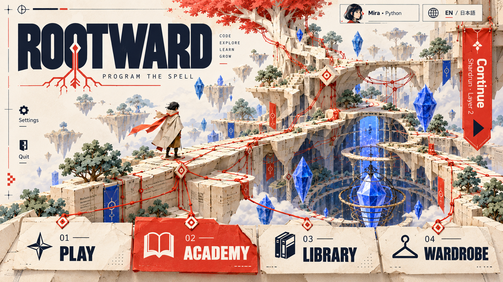
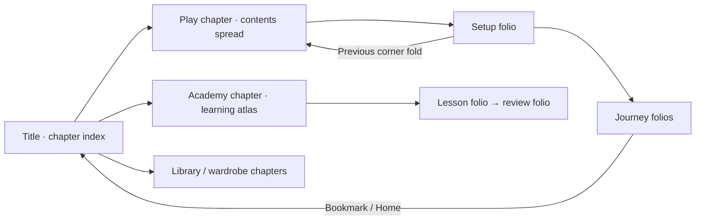

# Paper Circuit

**Graphic paper-world adventure.** A distinctive illustrated field manual: folded worlds, red root threads and large, confident typography.

| Surface | Color |
| --- | --- |
| Ivory | `#F5F0E6` |
| Ink | `#202836` |
| Vermilion | `#D94B39` |
| Ultramarine | `#405BD8` |
| Mint | `#B8CFBD` |

**Navigation.** Horizontal chapter index and field-manual page turns. Title: the logo and paper-world illustration fill the upper portion. Across the bottom, four oversized chapter tabs read Play, Academy, Library and Wardrobe. A Continue bookmark hangs from the upper-right edge. Profile, Settings and Quit are small labelled margin controls.

**Typography.** Bold geometric sans-serif display type, quiet sans-serif reading text and monospaced code. The editor stays a high-contrast rectangular working surface.

**World and art.** Layered paper terraces, folded machines, root-shaped red strings, faceted blue crystals and illustrated adventurers with strong silhouettes.

**Academy.** A printed learning atlas opens into practical lesson pages. Progress is a labelled concept diagram; task, editor and tests sit in clearly separated paper modules.

**Motion.** Brief page-slide transitions and a red thread drawing between nodes. Reduced motion leaves the completed thread visible without animation.

**Implementation consideration.** Paper texture stays behind illustrations and large headings. Code, settings and detailed card text need clean flat surfaces.

## Movement between menus

**Opening a section.** A chapter tab opens a two-page field manual. The top chapter strip remains visible, while local contents are numbered in the page margin. Modes are a printed chapter spread; setup turns to the next folio. Academy opens a learning atlas, and exercises turn successive pages. A corner fold or Back goes to the previous folio. Switching chapters moves sideways through the manual and preserves each chapter's current page.

**Keeping your place.** Chapter tabs, folio numbers and the Continue bookmark make location and progress visible. Panels stay aligned to the print grid during transitions.

**Keyboard and reduced motion.** Every spatial sign, dock station or chapter tab is also a focusable labelled button. Tab and arrow navigation follow a predictable order; Escape goes back one level. Camera pushes, drawer slides and page turns have immediate, static alternatives when reduced motion is enabled.

## Image set

- [Title screen](01-title.png)
- [Main menus: modes, setup, profiles, wardrobe, library and settings](02-main-menus.png)
- [Academy: learning map, lesson, walkthrough and review](03-academy.png)
- [Journey: draft, map, battle and workbench](04-journey.png)
- [Run menus: rewards, rest, inventory, pause, results and help](05-run-menus.png)

These are concepts for your review, with no game changes. See the [comparison gallery](../index.html), [shared menu structure](../README.md) and [generation prompts](../prompts.json).
