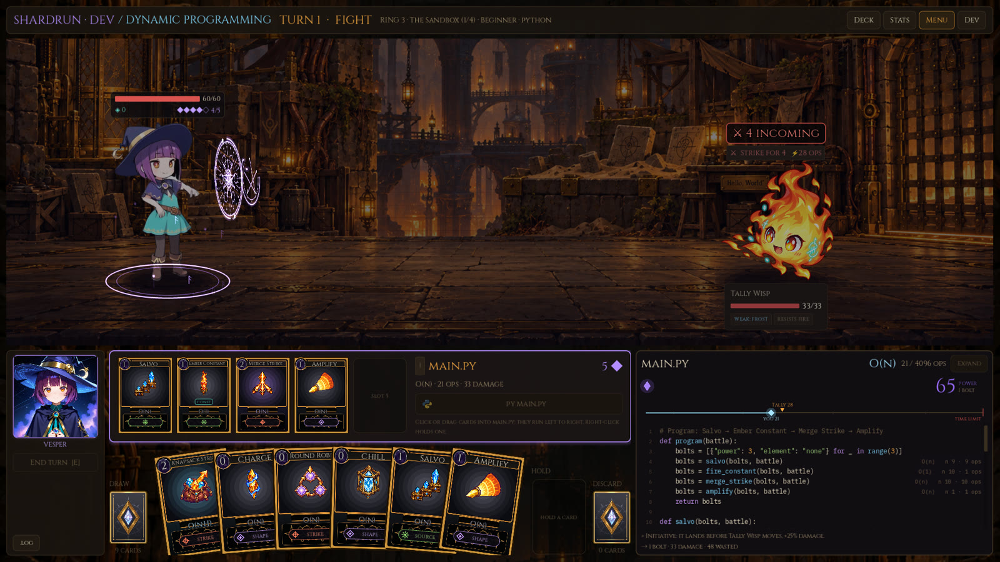
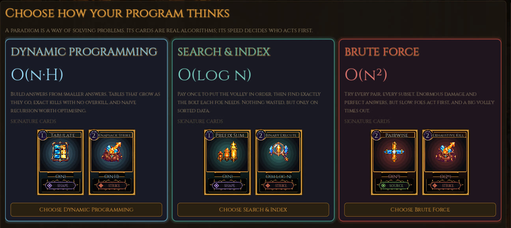
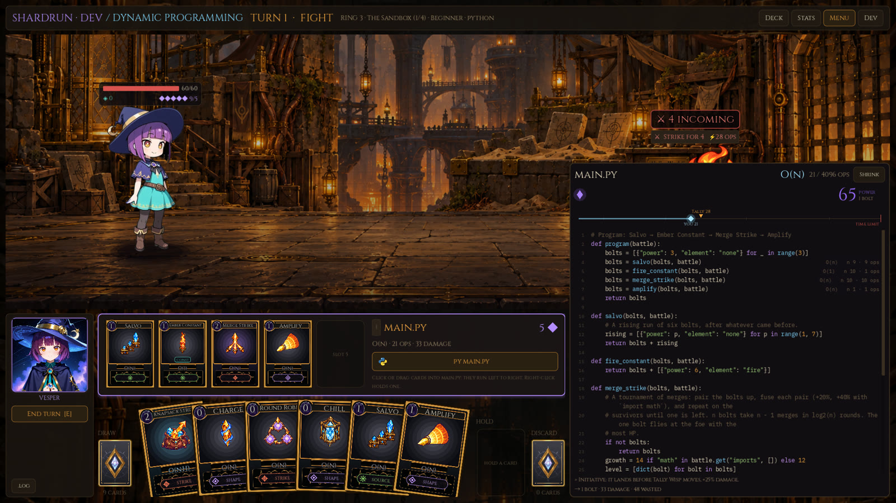
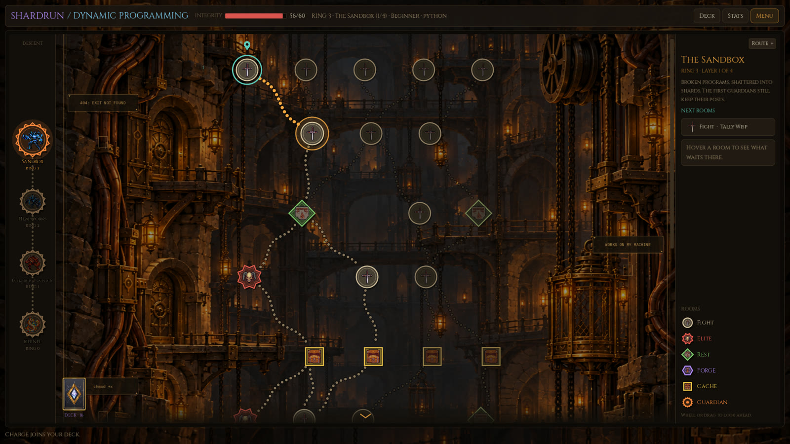

# Rootward

A programming roguelite. Your spells are chains of shards, and every shard is a real function in Python or
JavaScript, run in a sandbox: damage compounds, and Big-O prices the cast.

Godot 4.7.2, typed GDScript. English and Japanese.



A run starts with a **paradigm** (Divide & Conquer, Search & Index, Greedy, Brute Force, Dynamic Programming), a school
of real algorithms with a speed class. The cards are those algorithms. You play them in order into one program; the
program runs in the sandbox, and its measured work races the foes' tempo, so a slow program lets them act first.

| | |
|---|---|
|  |  |
|  | The rules are pure and seeded (`game/core/`); the sandbox is `wasmtime` running CPython and QuickJS as WASI modules (`game/sandbox/`, ADR-0002). |

## Run it

```
scripts/fetch-sandbox.sh   # once: wasmtime, CPython and QuickJS for WASI, about 100 MB, pinned by SHA-256
scripts/play.sh            # or: godot --path game
scripts/test.sh            # gdUnit4, headless
```

Needs Godot 4.7.2 on the PATH. Developed and tested on Linux. There is no licence file yet, so all rights are reserved
for now.

## Where to read

| To learn | Read |
|---|---|
| How to work here | `AGENT.md`, `CLAUDE.md` (commands, conventions) |
| What is done and next | `docs/PLAN.md` (live checklist) |
| Why it is built this way | `docs/decisions/` (ADRs, index in its README) |
| Direction and ideas | `docs/ROADMAP.md`, `docs/SHARDRUN_DESIGN.md`, `docs/ACADEMY_DESIGN.md` |
| Guardians | `docs/NewEnemies.md` (built, ADR-0026) |
| Run state's shape | `docs/shardrun-state.md` |
| Art, sound, music | `pipeline/README.md`, `docs/ArtUpdate.md`, `docs/SOUND_DESIGN.md` |
| Specialist agents | `docs/AGENTS.md` (the roster in `.claude/agents/`) |
| What was learned | `docs/LEARNING_LOG.md` |
